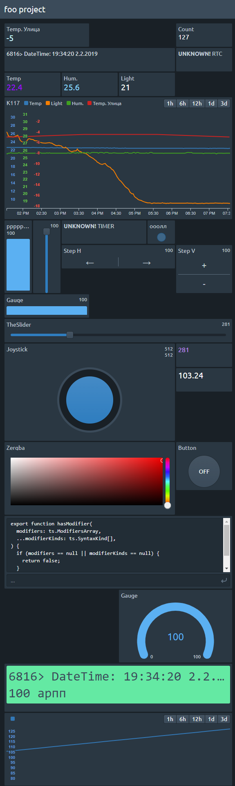

#

### :warning:

### WORK IN PROGRESS

**This is in early alpha stages, don't expect it to work reliably across versions yet. I'm looking for beta testers, so please post an issue if you find any problems or want to help out with this project in some way.**

---

# Blynk-Web-Client [](https://travis-ci.org/avin/blynk-web-client)

> SPA Web Client for [Blynk](https://www.blynk.cc/)

## Online client

[ >> [Get started!](http://blynk-client.surge.sh) << ]

## Build and install

You have to install [Node.js](https://nodejs.org/en/) and [Yarn](https://yarnpkg.com/en/) to build client-app.

Build procedure:

```
git clone --depth=1 https://github.com/avin/blynk-web-client.git
cd ./blynk-web-client
yarn
yarn run build
```

Then copy content of `build` folder to your web-server.``

### Preview



## License

MIT © [avin](https://github.com/avin)
